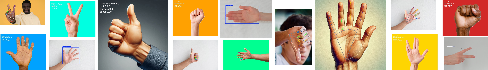
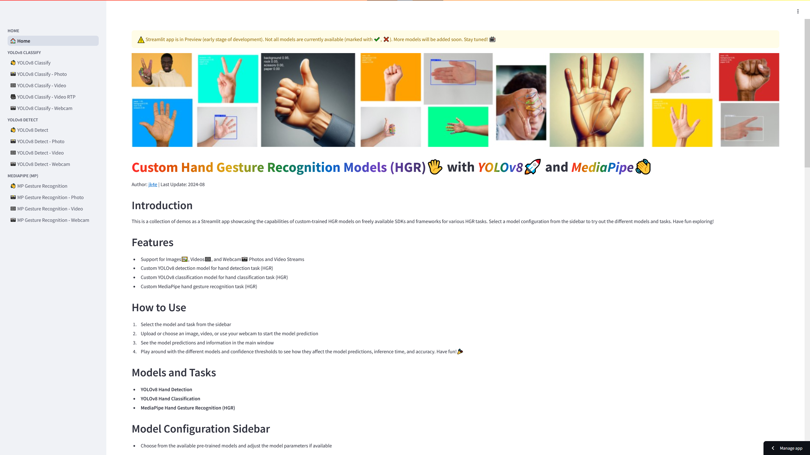
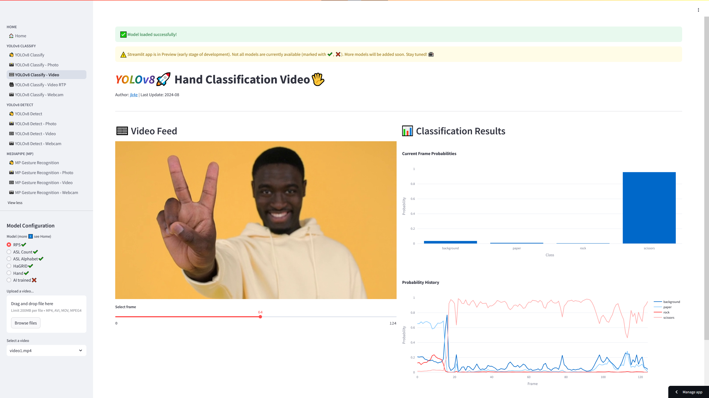
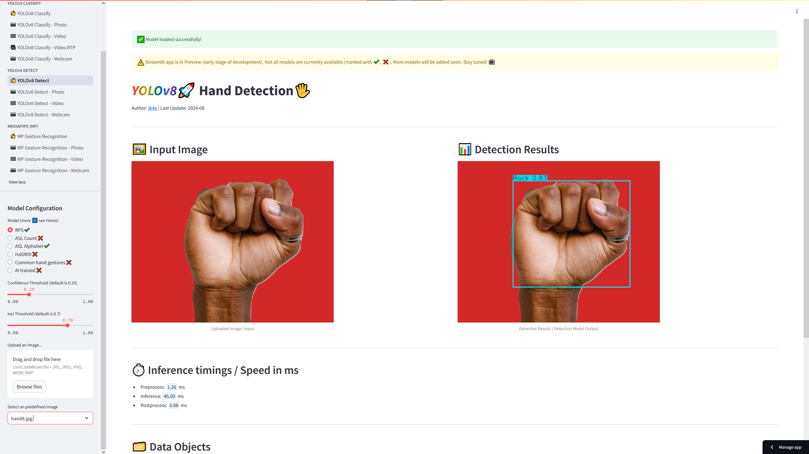
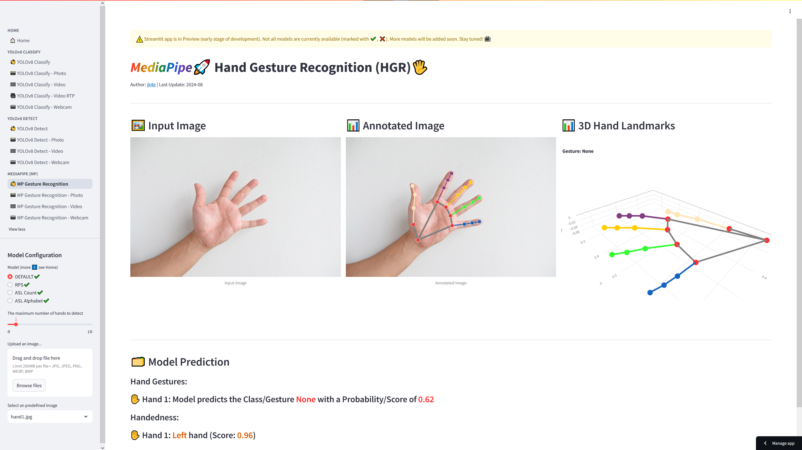

<div align="center">

# Custom Hand Gesture Recognition Models (HGR)🖐️ with YOLOv8🚀 and MediaPipe👋 - Streamlit App

</div>

Author: [jk4e](https://github.com/jk4e) | Last Update: August 2024



### ⚠️ Warning: This project/application is in preview and under development. Therefore there are still bugs/issues/errors, not refactored codebase, performance issues and not optimized model performance.

[](https://my-hgr.streamlit.app)

## Introduction

This is a collection of demos as a Streamlit app showcasing the capabilities of custom-trained HGR models on freely available SDKs and frameworks for various HGR tasks. Select a model configuration from the sidebar to try out the different models and tasks.
Have fun exploring!

## Features

- Support for Images🖼️, Videos🎞️, and Webcam📷 Photos and Video Streams
- Custom YOLOv8 detection model for hand detection task (HGR)
- Custom YOLOv8 classification model for hand classification task (HGR)
- Custom MediaPipe hand gesture recognition task (HGR)

## Streamlit WebApp [](https://my-hgr.streamlit.app)

Streamlit app (**M**ediapipe**Y**olo-**HGR**) with MediaPipe and YOLOv8 hand gesture recognition demos using custom trained models. The Streamlit Community Cloud is used to deploy the app.
Check it out!

**LINK TO APP**: https://my-hgr.streamlit.app

Note: You can change via settings the app theme between `Light` or `Dark` (default is `Use system setting`)

These screenshots show some app pages.

### Home Page with project information and description



### YOLOv8 Classification Page for Video Input



### YOLOv8 Detection Page for Image Input



### MediaPipe HGR Page for Image Input



## Resources, Tools and Packages

### Main Packages and Frameworks

This app uses custom-trained hand gesture models created with [YOLOv8](https://github.com/ultralytics/ultralytics), [MediaPipe Gesture Recognition Task](https://github.com/google-ai-edge/mediapipe), and [Streamlit](https://github.com/streamlit/streamlit) as the user interface.

### Annotation Tool

For image annotation, i used [CVAT (Computer Vision Annotation Tool)](https://github.com/cvat-ai/cvat). There are several free alternatives available in the market, such as those offered by [Roboflow Annotate](https://roboflow.com/annotate).

### Datasets for Customizing Models

Freely available datasets for training can be found on platforms like:

- [Roboflow](https://roboflow.com/)
- [Kaggle](https://www.kaggle.com/datasets)
- GitHub
- [Google Dataset Search](https://datasetsearch.research.google.com/)

Alternatively, you can generate your own dataset using a webcam on your PC or notebook.

### Hardware for Training

For training, it's recommended to have access to:

- A powerful NVIDIA GPU with CUDA support, or
- Cloud compute instances (e.g., [Google Colab](https://colab.google/) Free Plan for beginners offers a cloud-based Jupyter notebook environment)
  - Google Colab provides access to GPU resources and pre-installed libraries

### Deployment

This app is deployed on [Streamlit Community Cloud](https://streamlit.io/cloud), which is free to use. Other deployment options include:

- Private deployment on Streamlit Community Cloud
- Local usage
- Non-GUI options like Jupyter Notebook
- Custom GUI apps using packages like [Tkinter](https://docs.python.org/3/library/tkinter.html) or [PyQt](https://wiki.python.org/moin/PyQt)

## Sources

### YOLOv8

- [Ultralytics YOLO Docs ](https://docs.ultralytics.com/)
- [Model Training with Ultralytics YOLO](https://docs.ultralytics.com/modes/train/)
- [Object Detection](https://docs.ultralytics.com/tasks/detect/)
- [Image Classification](https://docs.ultralytics.com/tasks/classify/)

### MediaPipe

- [Gesture recognition task guide](https://ai.google.dev/edge/mediapipe/solutions/vision/gesture_recognizer)
- [Hand gesture recognition model customization guide](https://ai.google.dev/edge/mediapipe/solutions/customization/gesture_recognizer)

### ⚠️ Important Note on MediaPipe Model Maker Installation

As of August 2024:

- The latest version of [MediaPipe Model Maker](https://pypi.org/project/mediapipe-model-maker/) (current version 0.2.1.4) cannot be installed on Windows or Silicon-based macOS.
- For more details, see issues: [How to install mediapipe_model_maker 0.2.1.4 in Windows? #5545](https://github.com/google-ai-edge/mediapipe/issues/5545) or [ Windows Support #1206 ](https://github.com/tensorflow/text/issues/1206)

#### Workarounds:

1. Use a machine with Linux
2. Set up WSL2 (Windows Subsystem for Linux) on a Windows machine
   - See [Install WSL](https://learn.microsoft.com/en-us/windows/wsl/install) for instructions
3. Use Google Colab, a free cloud-based Jupyter notebook environment
   - Google Colab provides access to GPU resources and pre-installed libraries

#### When is MediaPipe Model Maker needed?

- This package is required if you want to train custom models with your own dataset.
- If you don't need to train or customize a model, you can simply install the [MediaPipe package](https://pypi.org/project/mediapipe/)
  - See the [Guide for Python](https://ai.google.dev/edge/mediapipe/solutions/setup_python) for installation instructions.

### Streamlit

- https://streamlit.io/
- [Live Inference with Streamlit Application using Ultralytics YOLOv8](https://docs.ultralytics.com/guides/streamlit-live-inference/)

## Local Installation and Requirements

This project requires Python 3.11. (Currently, only Python 3.11 is tested.)

### Create a new conda environment

```bash
# Create a new environment named 'my_hgr_env'
conda create -n my_hgr_env python=3.11 pip

# Activate the environment
conda activate my_hgr_env
```

Alternatively, you can use other virtual environment tools like `venv` or `virtualenv`.

### Clone the repository

```bash
git clone https://github.com/jk4e/my-hgr
cd my-hgr
```

### Install dependencies

```bash
pip install -r requirements.txt
```

This process may take several minutes depending on your internet connection and system performance.

Note for beginners: If these instructions are unfamiliar, consider searching for "Python beginner setup guide" or "How to use virtual environments in Python" for more detailed explanations. You can also use AI assistants like ChatGPT or Claude for step-by-step guidance tailored to your operating system.

## Running the Application

Ensure you're in the project directory and your virtual environment is activated, then run:

```bash
streamlit run streamlit-app.py
```

This command will start the Streamlit server and automatically open the application in your default web browser. If it doesn't open automatically, you can manually navigate to the URL displayed in the terminal (usually `http://localhost:8501`).

## 📋 My TODO List: Things that can be fixed, improved or added

### Software

- Fix bugs and errors
- Refactor codebase
- Optimize the performance, response time, and design of GUI

### Features

- Add new YOLOv8 tasks (Instance Segmentation or Pose Estimation)
- Add support for additional media input formats, e.g., YouTube videos
- Add support for user-uploaded models
- Collect, annotate, and preprocess new datasets for model training
- Train models with higher accuracy for better results (access to better hardware required)

## Disclaimer

This project is for educational purposes only.
